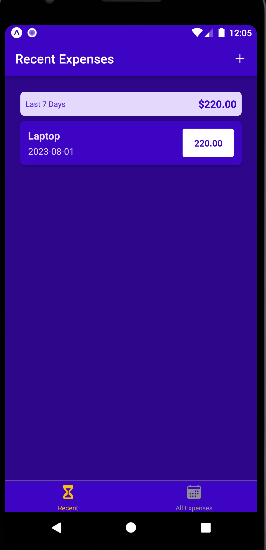

# Expense Tracker App

The Expense Tracker App is a mobile application designed to help you manage and track your expenses efficiently. With multiple screens and a user-friendly interface, you can easily add, update, and delete expenses, as well as view recent and all expenses at a glance.

## Features

- **Manage Expense**: Add, update, and delete expenses with ease. The Manage Expense screen allows you to maintain a detailed record of your spending.

- **Recent Expenses**: The Recent Expenses screen provides a quick overview of your most recent expenses, helping you stay up-to-date with your spending habits.

- **All Expenses**: View all your expenses in one place with the All Expenses screen. Easily search and filter expenses for a comprehensive overview.

- **Splash Screen**: The Expense Tracker App features a splash screen with the app logo, providing a smooth and visually appealing loading experience.

## Screenshots

 
 
 
 

## Installation

Follow these steps to run the Expense Tracker App on your mobile device:

1. Clone the repository to your local machine:

   ```
   git clone https://github.com/Hafilu/Expense-Tracker-App.git
   ```

2. Install dependencies using your package manager (e.g., npm or yarn):

   ```
   cd Expense-Tracker-App
   npm install
   ```

3. Set up Firebase for the dummy backend:

   - Create a Firebase project on the [Firebase Console](https://console.firebase.google.com/).
   - Obtain your Firebase Web API key and configuration.
   - Replace the dummy Firebase configuration in the app with your own Firebase configuration.

4. Start the development server:

   ```
   npm start
   ```

5. Use a mobile emulator or the Expo Go app on your physical device to test the app.

## Technologies Used

- React Native: A JavaScript framework for building cross-platform mobile applications.
- React Navigation: Handles navigation between screens using a stack and bottom tabs.
- Context API: Provides app-wide state management for efficient data sharing.
- FlatList: Renders a scrollable list of expenses for a smooth user experience.
- Firebase: Serves as the dummy backend to store and retrieve expense data.

## Contribution

Contributions to the Expense Tracker App are welcome! Feel free to submit bug reports, feature requests, or pull requests to help improve the app.

## Acknowledgments

Special thanks to Maximilian for helping me to create this amazing app!

## Contact

We hope you find the Expense Tracker App helpful in managing your expenses. If you have any questions or feedback, please don't hesitate to reach out. Happy tracking!
